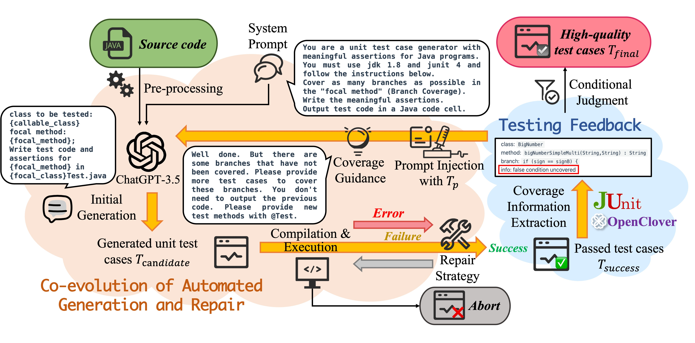

# TestART: Improving LLM-based Unit Testing via Co-evolution of Automated Generation and Repair Iteration

## Abstract

Unit testing is crucial for detecting bugs in individual program units but consumes time and effort. Recently, large language models (LLMs) have demonstrated remarkable capabilities in generating unit test cases.

However, several problems limit their ability to generate high-quality unit test cases:

1. Compilation and runtime errors caused by the hallucination of LLMs
2. Lack of testing and coverage feedback information restricting the increase of code coverage
3. The repetitive suppression problem causing invalid LLM-based repair and generation attempts

To address these limitations, we propose TestART, a novel unit test generation method. TestART improves LLM-based unit testing via co-evolution of automated generation and repair iteration, representing a significant advancement in automated unit test generation.

TestART leverages the template-based repair strategy to effectively fix bugs in LLM-generated test cases for the first time. Meanwhile, TestART extracts coverage information from successful test cases and uses it as coverage-guided testing feedback. It also incorporates positive prompt injection to prevent repetition suppression, thereby enhancing the sufficiency of the final test case.

This synergy between generation and repair elevates the correctness and sufficiency of the produced test cases significantly beyond previous methods. In comparative experiments:

- TestART demonstrates an 18% improvement in pass rate and a 20% enhancement in coverage across three types of datasets compared to baseline models
- It achieves better coverage rates than EvoSuite with only half the number of test cases

These results demonstrate TestART's superior ability to produce high-quality unit test cases by harnessing the power of LLMs while overcoming their inherent flaws.

## Approach

The workflow of TestART is illustrated as shown above. Given a source code, TestART initially performs pre-processing to alleviate the hallucination problem. Afterward, TestART leverages the ChatGPT-3.5 model to generate the initial set of test cases Tcandidate. 

Once generated, Tcandidate enters the co-evolution loop (depicted by the yellow arrows in the figure), which aims to produce high-quality final test cases. Specifically, TestART submits Tcandidate for compilation and execution to capture error messages.

Based on the captured errors (compilation errors, runtime errors, or other detected bugs), TestART applies the repair strategy to address these errors and recompiles and runs until it passes without bugs or reaches the maximum number of iterations. If the test cases still unsuccessful, Tcandidate is discarded. Otherwise, Tcandidate is promoted to Tsuccess. 

Next, TestART employs JUnit and OpenClover to evaluate the coverage of Tsuccess over the source code, transforming the uncovered areas into test feedback. If Tsuccess meets the coverage standard, it will be output as the final result (Tfinal). Otherwise, Tsuccess and the coverage-guidance feedback are provided as positive prompt injections to the ChatGPT-3.5 model, continuing to the next co-evolution loop and revert to Tcandidate. 

TestART leverages the co-evolution mechanism between automated test generation and repair. Benefiting from this synergy, TestART can iterate test cases incrementally and ensure that each round of test cases passes successfully, which continuously improves coverage.

## Research Questions

**RQ1:** How does the correctness of the test case of TestART compare to the baseline? What are the error types in the test cases and how well does TestART repair different error types?

**RQ2:** How does the sufficiency of the test case of TestART compare to the baseline?

**RQ3:** How does the combination of different parts impact the robustness of TestART?

**RQ4:** What is the performance of TestART when applied to unlearned datasets, and how well does it generalize to new data?